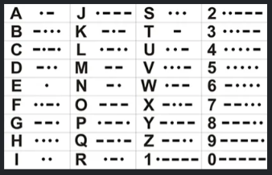

# Tradutor de Código Morse

## Descrição do Desafio

O objetivo do desafio é  definir uma arquitetura que resolva a solução utilizando o código morse como protocolo de comunicação e pensando em como esta solução poderia ser criada de forma que fosse o mais escalável possível.

## Tabela Base



## Descrição do fluxo e arquitetura

Para o desenvolvimento da aplicação, dado o pouco tempo disponivel, optei por uma arquiterura simplificada, visando agilidade no seu desenvolvimento.

Utilizei tecnologias baseadas em Python (Flask) e JavaScript, que me proprocionaram a agilidade e pouca verbosidade no código.

A estrutura do projeto e simplificada, acoplando todos os elementos em um pequeno monolito (FrontEnd/BackEnd).

Foi construida uma interface web com utilização de HTML5, CSS3 e JavaScript, sendo todos este elementos com pequenas lib's de apoio tais como:

* BootStrap
* JQuery

Basicamente o usuário aciona a aplicação, digita sua mensagem em código morse, clica em um botão e submete sua mensagem ao backend via protocolo websocket (com auxilio da lib socket.io).

Na outra ponta do sistema, com o auxilio de algumas lib's (flask-socketio e simple-websocket), o backend desenvolvido em python recebe a mensagem e a envia a um pequeno método tradutor.

Este método consiste apenas em um pequeno buscador que procura pela tradução adequada dos caracteres da mensagem em um pequeno dicionário.

Após a indentificação de todos o caracteres da mensagem, retorna a tradução para o frontend.

Para execução e distribuição optei por utilizar um container docker, pois com este posso empacotar todos os recursos necessários a aplicação.


## Como Executar

Supondo que vc possua o docker instalado e configurado em sua máquina, basta criar a imagem, utilizando o Dockerfile embutido na aplicação e colocar o container em execução, ou executar um dos comandos abaix, com base no seu sistema operacional.

```buildoutcfg
./executar.sh
```

```buildoutcfg
executar.bat
```

**OBS:** Após o comando acima, abra a url [http://127.0.0.1:8000](http://127.0.0.1:8000)


## Funcionalidades e Arquitetura desejada

Como o meu tempo foi escasso não pude implementar funcionalidades mais complexas e uma arquitetura que fosse rapidamente escalavel.

Seguem abaixo os próximos passos que deveriam ser dados no desenvolvimento dessa aplicação.

### Funcionalidades

* Implementação de cadastro de usuário e processo de autenticação
* Dividir a aplicação em duas aplicações distintas, uma para FrontEnd e outra para o Backend
* Criação de log's da aplicação
* Criação de processo de monitoramento para a aplicação 
* Implantação de testes unitários
* Implantação de CI/CD no processo de desenvolvimento
* Verificação de um QA, com possíveis implementações de testes automatizados
* Documentação do código 
* Documentação do endpoints (poderia ser utilizado o swagger)
* Melhorias na interface do usuário


### Arquitetura / Escalabilidade

Nos dias de hoje, a oferta de sistemas dedicados e automatizados para a criação/manteneção de infraestrutura de TI é vasta no mercado, o que torna os envestimentos em uma infraestrutura on premise, muitas vezes, desperdício de dinheiro.

Minha estratégia de escalabilidade pressupõe a utilização dos serviços da AWS (Amazon Web Services). 

* Implementar a aplicação FrontEnd no AWS Amplify, pois este gerenciaria todos os componentes estáticos, cuidando de forma automática da escalabilidade.
* Implementar a aplicação BackEnd no AWS Lambda, pois este recurso tambem possui um eficiente gerenciamento de recursos, de forma automática, que automatizam/facilitam a escalabilidade desta parte da aplicação.


